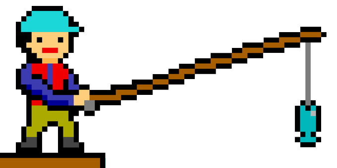

# FISHERMAN

Bu proje, HTML5 Canvas ve JavaScript kullanılarak geliştirilmiş bir balıkçı simülasyon oyunudur. Oyunda teknenizi sağa/sola hareket ettirip balık tutabilir, balıklarınızı satabilir ve kazandığınız parayla teknenizi geliştirebilirsiniz.

## OYUN

Balıkcıya tıklayarak oyuna ulaşabilirsiniz.

## Özellikler

- Sağ/sol ok tuşları ile tekneyi hareket ettirme
- E tuşu ile balık tutma veya balık satma moduna geçiş
- Q tuşu ile balık tutmayı bırakma veya satış ekranından çıkış
- Balık kapasitesi ve para sistemi
- Tersane ekranı: Tekne hızını ve balık kapasitesini artırma
- Satış ekranı: Balık Satışı ve animasyonlu kazanç gösterimi
- Modern ve görsel açıdan zengin arayüz
- 100 balık sattığınızda oyun biter

## Nasıl Oynanır?

1. Oyuna başlamak için "Oyuna Başla" butonuna tıklayın.
2. Sağ/Sol ok tuşları ile tekneyi hareket ettirin.
3. Sol kenara gelince E tuşuna basarak balık tutma moduna geçin.
4. Kancayı balıklara değdirerek balık yakalayın.
5. Q tuşu ile balık tutmayı bırakıp tekneye dönün.
6. Sağ kenara gelince E tuşuna basarak balıklarınızı satın.
7. Kazandığınız parayla Tersane'de (orta noktada E tuşu) tekne hızınızı veya balık kapasitenizi artırabilirsiniz.
8. Toplam 100 balık sattığınızda oyun sona erer.

## Kontroller

- **Sağ/Sol Ok Tuşları:** Tekneyi hareket ettir
- **E:** Balık tutma/satma/tersane moduna gir
- **Q:** Balık tutmayı bırak veya satış/tersane ekranından çık
- **1:** Tersanede tekne hızını artır (100₺)
- **2:** Tersanede balık kapasitesini artır (150₺, max 15)

## Ekran Görüntüleri

## Oynanış Videosu

- [Oynanış Videosu](https://www.youtube.com/watch?v=fMGC2zpsUvE)

## Kullanılan Teknolojiler
- HTML5
- CSS
- JavaScript

## Tasarım 
- [Tasarımlar](https://free-game-assets.itch.io/free-fishing-pixel-art-pack)
- Diğer görseller Adobe Photoshop uygulamasıyla çizildi ve düzenlendi.

## Kullanılan Sesler
- [Arka plan Müziği](https://www.youtube.com/watch?v=yEorHVdQdCQ)
- [Sesler](https://memesoundeffects.com/)

## Katkı ve Lisans

Örnek alınan oyun: [Scale the Depths](https://serpexnessie.itch.io/scale-the-depths)
